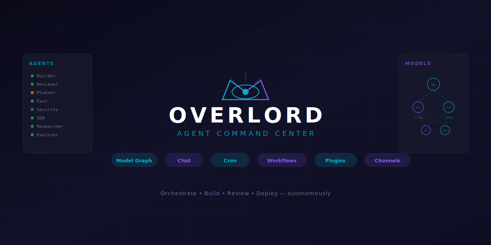
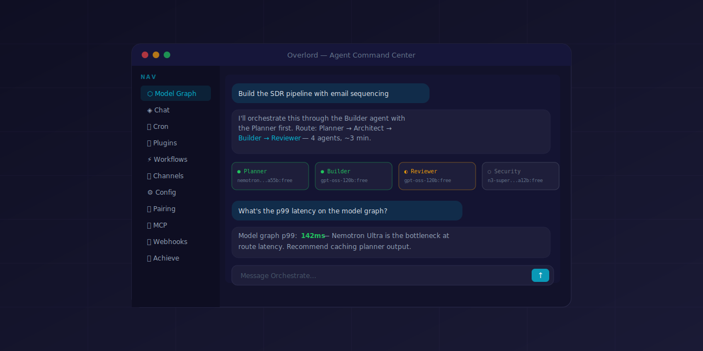

<div align="center">



<br />

**AI Agent Orchestration Platform** — Route, build, review, and deploy through multiple specialized AI agents with a unified command center.

<br />



</div>

---

## What is Overlord?

Overlord is a **multi-agent command center** built on Next.js that orchestrates AI-powered workflows across specialized agents — Planner, Architect, Builder, Reviewer, Security, SDR, and more. It provides:

- **Model Graph** — Visualize and route between AI models (Nemotron Ultra, GPT-OSS, Nex-N2, etc.) with full slug visibility (`:free` suffix on all applicable)
- **Chat** — Multi-model conversations with inline model switching and agent dispatch
- **Cron** — Schedule and monitor recurring agent tasks
- **Plugins** — Extend capabilities with a plugin architecture
- **Workflows** — Chain agents into pipelines (Plan → Architect → Build → Review)
- **Channels** — Connect to Discord, Telegram, and other platforms
- **Config** — Manage Overlord settings and agent configurations
- **MCP** — Model Context Protocol server management
- **Webhooks** — Incoming/outgoing webhook configuration
- **Pairing** — Device and session pairing
- **Achievements** — Track agent milestones and performance

## Architecture

```
┌─────────────────────────────────────────────────────┐
│                    Overlord UI                       │
│  ┌──────────┐ ┌──────────┐ ┌──────┐ ┌──────────┐  │
│  │Model Graph│ │   Chat   │ │ Cron │ │ Plugins  │  │
│  └──────────┘ └──────────┘ └──────┘ └──────────┘  │
│  ┌──────────┐ ┌──────────┐ ┌──────┐ ┌──────────┐  │
│  │Workflows │ │ Channels │ │Config│ │   MCP    │  │
│  └──────────┘ └──────────┘ └──────┘ └──────────┘  │
│  ┌──────────┐ ┌──────────┐ ┌──────────────────────┐│
│  │ Webhooks │ │ Pairing  │ │    Achievements     ││
│  └──────────┘ └──────────┘ └──────────────────────┘│
└─────────────────────────────────────────────────────┘
                         │
                    Next.js API
                         │
              ┌──────────┴──────────┐
              │     OpenRouter      │
              │  (Model Routing)    │
              └─────────────────────┘
```

## Agent Paths

| Path | Agents | Use Case |
|------|--------|----------|
| **Path 1** | Planner → Architect → Builder → Reviewer | Complex multi-step builds |
| **Path 2** | Builder | Heavy fix / fast build |
| **Path 3** | Docs | Specs, documentation, copy |
| **Path 4** | Fast | Narrow fix, quick task |
| **Path 5** | Utility | Shell glue, cleanup |
| **Path 6** | Researcher | Research, decks, landing pages |
| **Path 7** | Refactor | Code refactoring |
| **Path 8** | Silent-Failure | Silent failure hunting |
| **Path 9** | E2E | End-to-end testing |
| **Path 10** | Explorer | Read-only codebase exploration |

## Tech Stack

- **Next.js 16** — App router, React Server Components
- **Tailwind CSS** — Utility-first styling
- **Zustand** — State management
- **OpenRouter** — Multi-provider model routing (all `:free` models)

## Getting Started

```bash
git clone git@github.com:therealmckellar/overlord.git
cd overlord
npm install
npm run dev
```

Open [http://localhost:9125](http://localhost:9125) — port 9125, never 3000.

## Environment

Create `.env.local`:

```env
NEXTAUTH_SECRET=<your-secret>
NEXTAUTH_URL=http://localhost:9125
OPENROUTER_API_KEY=<your-openrouter-key>
```

## License

Private — © Rich McKellar
