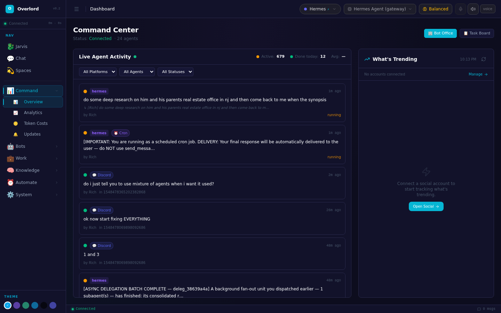
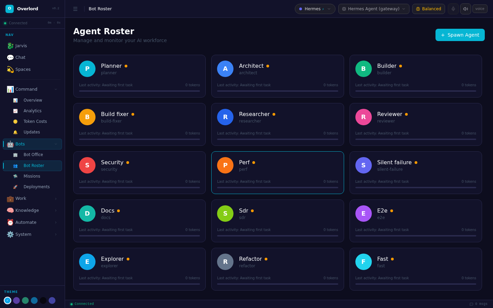
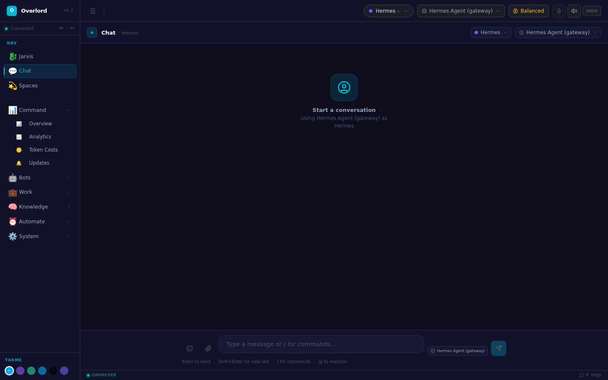
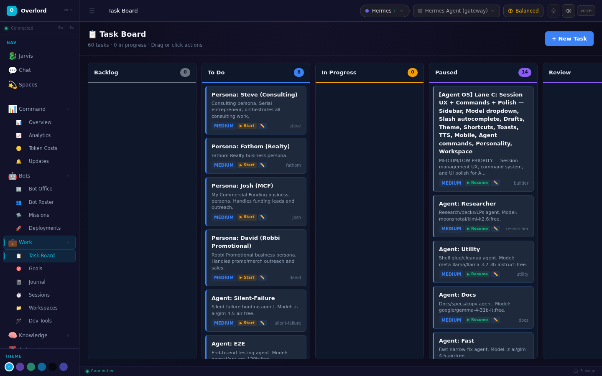
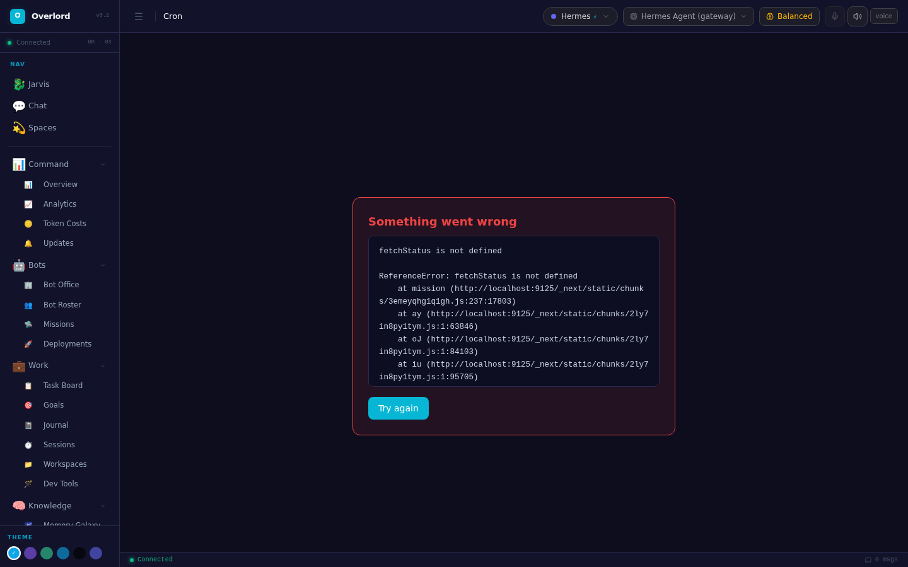
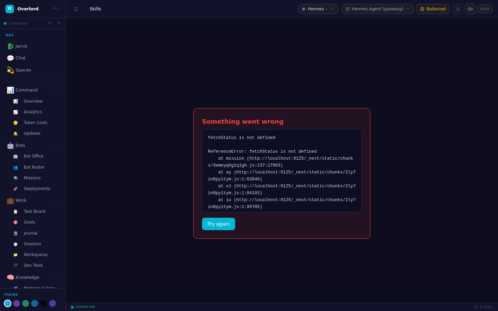
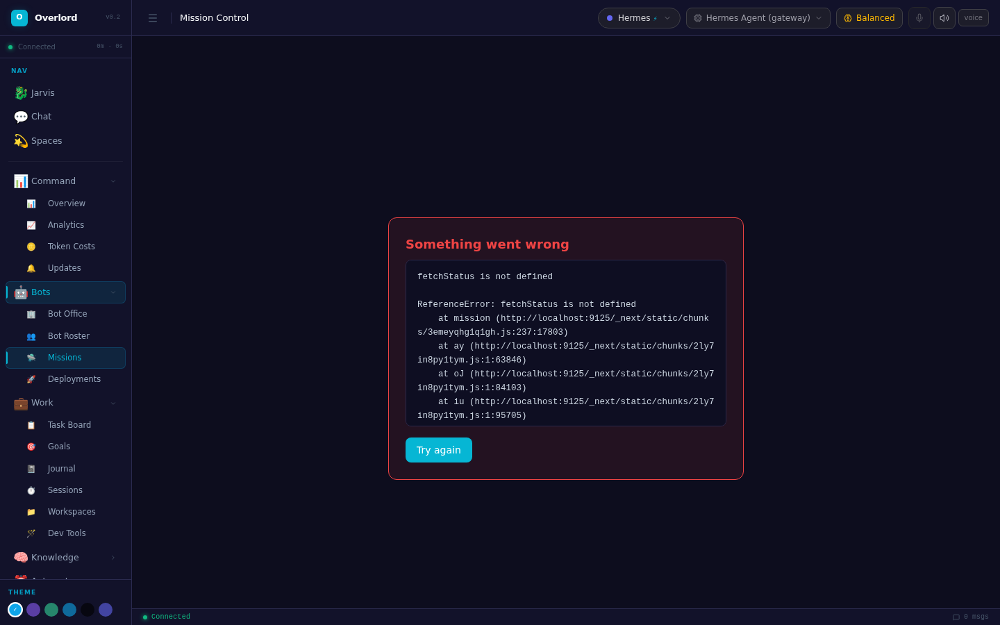
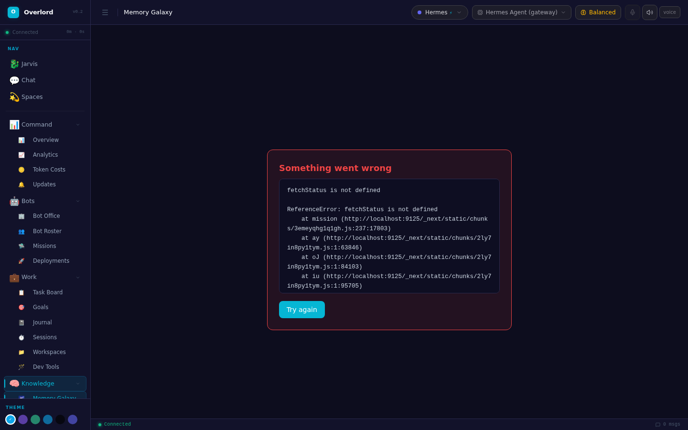

<div align="center">



# Overlord

**Multi-agent AI orchestration platform** — Route, build, review, and deploy through specialized AI agents from a single command center.

[](https://nextjs.org)
[](#)
[](#)

[Live Demo](https://overlord.mckellar.dev) · [Report Bug](https://github.com/therealmckellar/overlord/issues) · [Request Feature](https://github.com/therealmckellar/overlord/issues)

</div>

---

## What It Does

Overlord is a **command center for AI agents**. It gives you a visual UI to orchestrate multi-agent workflows — planning, coding, reviewing, testing, and deploying — across multiple model providers. Every agent run is observable, replayable, and routed through a deterministic execution layer.

**Built for:** developers, AI teams, and anyone running multiple LLM agents who needs visibility and control.

---

## Features

<div align="center">

</div>

### 🏢 Agent Office
Visual floorplan showing all your agents — their status, model assignments, and live activity. Drag, position, and monitor agents like a real operations floor.

---

<div align="center">

</div>

### 💬 Multi-Model Chat
Switch between models mid-conversation. Send tasks to specific agents inline. Full markdown rendering with code highlighting, LaTeX, and streaming responses.

---

<div align="center">

</div>

### 📋 Task Board
Kanban-style task management for agent workflows. Track jobs from intake through completion with real-time status updates across all connected platforms.

---

<div align="center">

</div>

### ⏰ Cron Scheduler
Schedule recurring agent tasks — daily research digests, automated code reviews, periodic deployments. Full cron expression support with execution history.

---

<div align="center">

</div>

### 🧠 Skills & Memory
Agent skills loaded on-demand for specialized tasks. Persistent memory across sessions with Mnemosyne integration — agents remember context, preferences, and learned procedures.

---

<div align="center">

</div>

### 📡 Mission Control
Real-time overview of all agent activity — active runs, completions, failures, and platform connections. Discord, Telegram, Buzz, and webhooks all in one view.

---

## Agent Routing

Overlord routes tasks to specialized agents based on complexity and type:

| Path | Pipeline | When to Use |
|------|----------|-------------|
| **1** | Planner → Architect → Builder → Reviewer | Complex multi-step builds |
| **2** | Builder → Reviewer | Single focused task |
| **3** | Docs | Specs, documentation, copy |
| **4** | Fast | Quick fix, narrow scope |
| **5** | Utility | Shell glue, cleanup |
| **6** | Researcher | Research, decks, landing pages |
| **7** | Refactor | Code restructuring |
| **8** | Explorer | Read-only codebase analysis |
| **9** | E2E | End-to-end testing |

---

## Architecture

```
┌──────────────────────────────────────────────────┐
│              Overlord UI (Next.js)                │
│                                                   │
│   Model Graph · Chat · Cron · Workflows          │
│   Skills · Memory · Task Board · Channels        │
│                                                   │
├──────────────────────────────────────────────────┤
│              API Layer (src/)                     │
│                                                   │
│   Agent Dispatch · Provider Routing · State      │
│                                                   │
├──────────────────────────────────────────────────┤
│   SQLite (better-sqlite3)  │  OpenRouter API     │
│   Agent state & history    │  Multi-model routing │
└──────────────────────────────────────────────────┘
```

---

## Tech Stack

| Layer | Technology |
|-------|-----------|
| **Framework** | Next.js 15 (App Router, PWA) |
| **UI** | React, Tailwind CSS, lucide-react |
| **State** | Zustand (client), SQLite (persistence) |
| **Models** | OpenRouter — Nemotron Ultra, Gemma 4, MiMo, Inkling, Laguna XS |
| **Graph** | react-force-graph-3d / Three.js |
| **Rendering** | shiki, react-markdown, KaTeX |
| **Channels** | Discord, Telegram, Buzz (Nostr), Webhooks |

---

## Getting Started

```bash
git clone git@github.com:therealmckellar/overlord.git
cd overlord
npm install
npm run dev
```

Open **[http://localhost:9125](http://localhost:9125)**

### Environment

```env
NEXTAUTH_SECRET=<your-secret>
NEXTAUTH_URL=http://localhost:9125
OPENROUTER_API_KEY=<your-openrouter-key>
```

---

## Screenshots

<div align="center">


</div>

<p align="center"><em>Left: Configuration & provider management · Right: Agent memory & knowledge base</em></p>

---

<div align="center">

**Built by [Richard McKellar](https://mckellar.dev)** · [My Commercial Funding](https://mycommercialfunding.com)

</div>
